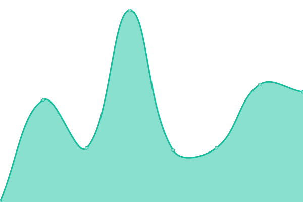

# [📈 Live Status](https://status.skiddle.id): <!--live status--> **🟧 Partial outage**

This repository contains the open-source uptime monitor and status page for [Skiddle-ID](https://status.skiddle.id), powered by [Upptime](https://github.com/upptime/upptime).

With [Upptime](https://upptime.js.org), you can get your own unlimited and free uptime monitor and status page, powered entirely by a GitHub repository. We use [Issues](https://github.com/Skiddle-ID/monitoring/issues) as incident reports, [Actions](https://github.com/Skiddle-ID/monitoring/actions) as uptime monitors, and [Pages](https://status.skiddle.id) for the status page.

<!--start: status pages-->
<!-- This summary is generated by Upptime (https://github.com/upptime/upptime) -->
<!-- Do not edit this manually, your changes will be overwritten -->
<!-- prettier-ignore -->
| URL | Status | History | Response Time | Uptime |
| --- | ------ | ------- | ------------- | ------ |
|  [Main Website](https://skiddle.id) | 🟥 Down | [main-website.yml](https://github.com/Skiddle-ID/monitoring/commits/HEAD/history/main-website.yml) | 

 0ms
     
 | 

<a href="https://status.skiddle.id/history/main-website">0.00%</a>
    

|  [Plex Media Server](https://25950.skiddle.id) | 🟥 Down | [plex-media-server.yml](https://github.com/Skiddle-ID/monitoring/commits/HEAD/history/plex-media-server.yml) | 

 857ms
     
 | 

<a href="https://status.skiddle.id/history/plex-media-server">22.49%</a>
    

|  [Arcestia Web](https://arcestia.com) | 🟩 Up | [arcestia-web.yml](https://github.com/Skiddle-ID/monitoring/commits/HEAD/history/arcestia-web.yml) | 

 196ms
     
 | 

<a href="https://status.skiddle.id/history/arcestia-web">100.00%</a>
    

|  [Arcestia Medium](https://catatan.arcestia.com) | 🟩 Up | [arcestia-medium.yml](https://github.com/Skiddle-ID/monitoring/commits/HEAD/history/arcestia-medium.yml) | 

 1012ms
     
 | 

<a href="https://status.skiddle.id/history/arcestia-medium">100.00%</a>
    

|  [Socialize (Mastodon Instance)](https://socialize.cyou) | 🟩 Up | [socialize-mastodon-instance.yml](https://github.com/Skiddle-ID/monitoring/commits/HEAD/history/socialize-mastodon-instance.yml) | 

 995ms
     
 | 

<a href="https://status.skiddle.id/history/socialize-mastodon-instance">100.00%</a>
    

<!--end: status pages-->

[**Visit our status website →**](https://status.skiddle.id)

## 📄 License

- Powered by: [Upptime](https://github.com/upptime/upptime)
- Code: [MIT](./LICENSE) © [Skiddle-ID](https://status.skiddle.id)
- Data in the `./history` directory: [Open Database License](https://opendatacommons.org/licenses/odbl/1-0/)
